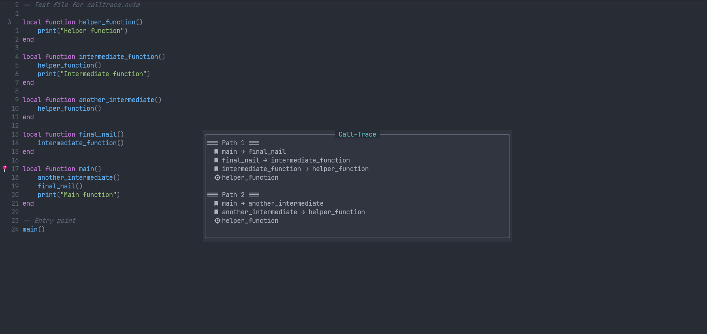

# calltrace.nvim

Trace function call paths from any point in your code back to a referencefunction using LSP and Treesitter.

> **Note**: This plugin is still in active development. Some/Many features are missing or incomplete.

## What it does

Set a referencepoint (like `main()` or a any other entrypoint), then trace a backward from any function to see how execution could reach that reference point.
The Plugin uses your existing LSP setup and Treesitter for the analysis.

The following image for example demonstrates an exemplary tracking and its result:



For example if we want to see how/if `helper_function` gets called from `main` and what paths it could take we could trace from `main` to `helper_function`. 

## Installation

### Configoptions
Default configuration of the plugin is:
```lua
M.defaults = {
    -- Maximum Depth to trace (prevent infinite loops)
    max_depth = 50,

    -- Displayoptions
    display = {
        -- "quickfix" | "float" | "split" | "telescope"
        -- TODO Implement the others
        backend = "float",
    },

    -- Performance options
    timeout = 5000,                 -- ms for LSP requests
    cache_results = true,           -- TODO Implement

    -- Filtering - exclude certain files/dirs from trace
    exclude_patterns = {
        "node_modules/",
        "*/test/*",
    },

    -- UI-Customization
    icons = {
        reference = "📍",   -- currently used for shortly set reference (may provoke misunderstandings -> TODO Look at it)
        call = "󰃀",
        path = "→",
    },

    -- Debugmode
    debug = false,
}
```

### packer.nvim
```lua
use {
    'bernisc/calltrace',
    config = function()
        require'calltrace'.setup({
            display = {
                backend = "float",
            },
        })
    end
}
```
or with default configs:
```lua
use 'bernisc/calltrace'
```

## Usage

1. Put cursor on your entry function (ideally the name of the function) and run `:CalltraceSetReference`
2. Put cursor on any other function (again, ideally the name) and run `:CalltraceTrace`
3. View the call paths in a floating window

### Neovim Commands
- `:CalltraceSetReference` - Set reference point at cursor
- `:CalltraceTrace` - Trace from cursor to reference
- `:CalltraceClearReference` - Clear reference point
- `:CalltraceShowReference` - Jump to reference point
- `:CalltraceToggleDebug` - Enable Debug logging

### Lua API
```lua
local calltrace = require("calltrace")

calltrace.setup({
    max_depth = 50,
    display = { backend = "float" },
    timeout = 5000,
})

calltrace.set_reference()
calltrace.trace()

-- Also supports directly overriding configs for single operations like:
require('calltrace').trace({ display = { backend = "float" } })
```

## Use Cases

- **Understanding Legacy Code**: Discover how deeply nested functions fit into the bigger picture
- **Debugging**: Trace execution flow to understand call hierarchies
- **Code Review**: Verify that functions are called from expected entry points
- **Documentation**: Generate call path documentation for complex systems
- **Refactoring**: Identify all paths to a function before making changes

## Current Status

**Working:**
- ✅ Basic reference point management
- ✅ LSP-based reference finding
- ✅ Treesitter function detection
- ✅ Backward tracing algorithm
- ✅ Floating window display
- ✅ Multi-path support

**Todo:**
- [ ] Implement Resultcaching
- [ ] Implement the other displaybackends (quickfix, telescope)
- [ ] Cross-file optimization
- [ ] Better language support
- [ ] Performance improvements -> For example async calls
- [ ] More tests

## Requirements

- Neovim >= I dont know yet, will have to look into it
- LSP server for your language
- nvim-treesitter with appropriate parsers

Tested with Lua, should work with most languages that have proper LSP and Treesitter support.
